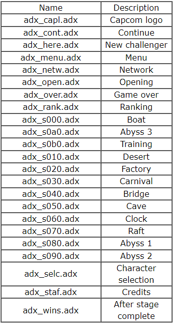

# MvC2_Remix
 A MvC2 Customization Script (PS2 version only)

## Requirements

- .NET Core Runtime 3.1
- Python 3.8+

Currently only Windows 10 is supported.

## Installation

Just clone repo or download zip.

## Usage

Put your MvC2 iso in the script folder and rename it to MvC2.iso (disable hide extensions in Windows Explorer to avoid confusions).

Put the disired mp3 files in the music folder
Rename it following this standard:

Image source: zachd.com/mvc2/resources/mvc2/sounds_music.html

Open Command Prompt on the script folder and run it with python MvC2_Remix.py

That's all.

## Credits

AFSPacker by MaikelChan

PowerISO by Power Software Ltd.

ffmpeg by FFmpeg team
